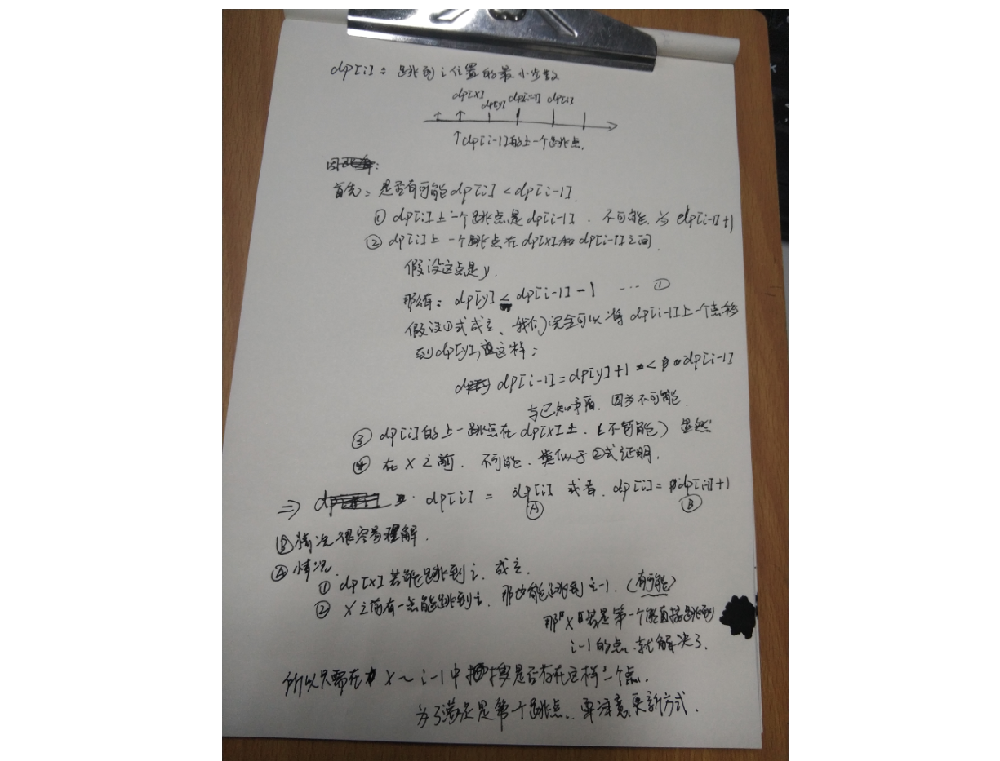

#### 题目
```
Given an array of non-negative integers, you are initially positioned at the first index of the array.

Each element in the array represents your maximum jump length at that position.

Your goal is to reach the last index in the minimum number of jumps.

Example:

Input: [2,3,1,1,4]
Output: 2
Explanation: The minimum number of jumps to reach the last index is 2.
    Jump 1 step from index 0 to 1, then 3 steps to the last index.
Note:

You can assume that you can always reach the last index.
```
### 正确解题方法 贪心
 为了较快的跳到末尾，我们想知道每一步能跳的范围，这里贪婪并不是要在能跳的范围中选跳力最远的那个位置，因为这样选下来不一定是最优解，这么一说感觉又有点不像贪婪算法了。我们这里贪的是一个能到达的最远范围，我们遍历当前跳跃能到的所有位置，然后根据该位置上的跳力来预测下一步能跳到的最远距离，贪出一个最远的范围，一旦当这个范围到达末尾时，当前所用的步数一定是最小步数。我们需要两个变量cur和pre分别来保存当前的能到达的最远位置和之前能到达的最远位置，只要cur未达到最后一个位置则循环继续，pre先赋值为cur的值，表示上一次循环后能到达的最远位置，如果当前位置i小于等于pre，说明还是在上一跳能到达的范围内，我们根据当前位置加跳力来更新cur，更新cur的方法是比较当前的cur和i + A[i]之中的较大值，如果题目中未说明是否能到达末尾，我们还可以判断此时pre和cur是否相等，如果相等说明cur没有更新，即无法到达末尾位置，返回-1。[参考](http://www.cnblogs.com/grandyang/p/4373533.html)

#### 超时方法 dp 
看题解前，我想的用动态规划。果断超时orz.
